# 🪄 Step-by-Step Setup

## 1. 🛠 Create an IAM User in AWS
- Go to [AWS IAM Console](https://console.aws.amazon.com/iam/)
- Create a user with **AWS S3 Full Access**
- Attach the necessary policy

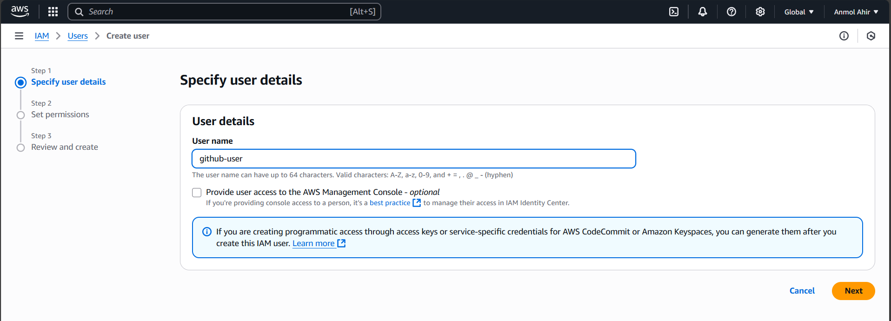

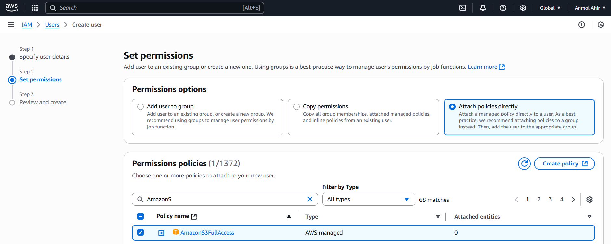


## 2. ✅ Create an S3 Bucket
- Go to [AWS S3 Console](https://s3.console.aws.amazon.com/)
- Click **Create bucket**
- Set:
  - Bucket name: `react-test-app-anmol`
  - Region: e.g., **Asia Pacific (Mumbai)** - `ap-south-1`
- Leave other settings default and click **Create bucket**

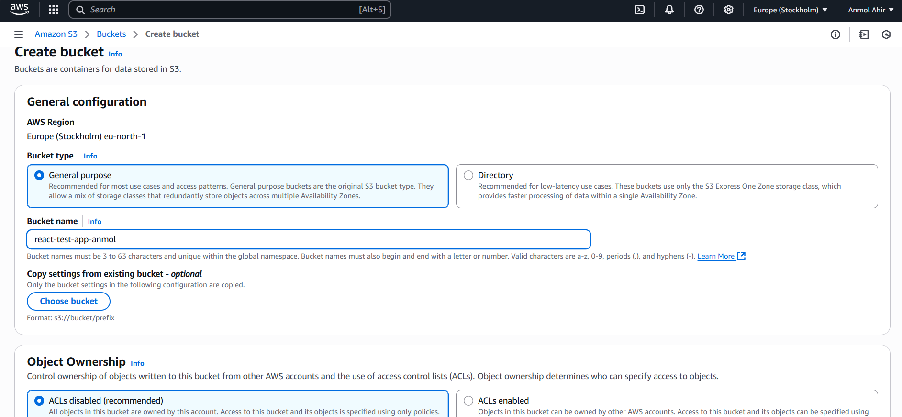

## 3. 🌐 Enable Static Website Hosting
- Go to your created bucket
- Open **Properties** tab
- Scroll to **Static website hosting** > Click **Edit**
- Enable **Static website hosting**
- Set:
  - Index document: `index.html`
  - Error document: `index.html` (or `error.html` optionally)
- Click **Save changes**

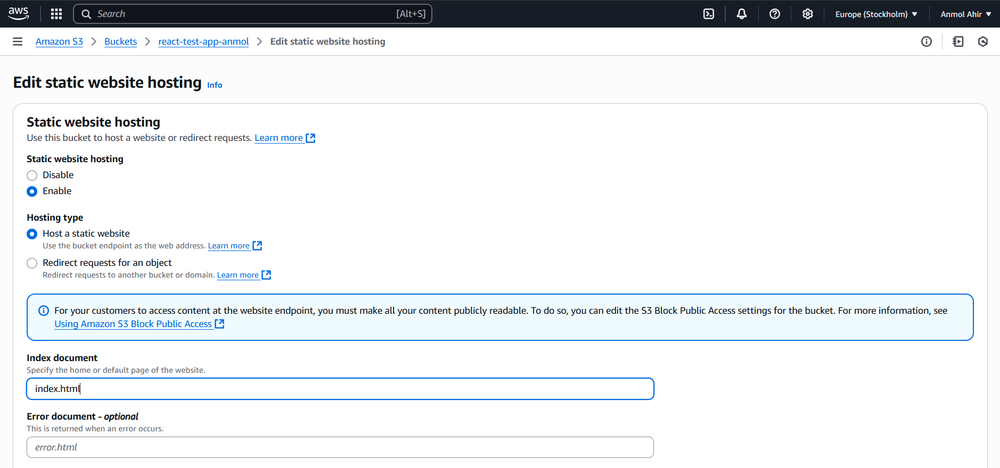

## 4. 🔓 Allow Public Access
- Go to **Permissions** tab
- Under **Block public access (bucket settings)**, click **Edit**
- Uncheck all options (especially “Block all public access”)
- Confirm by checking the warning box
- Click **Save changes**

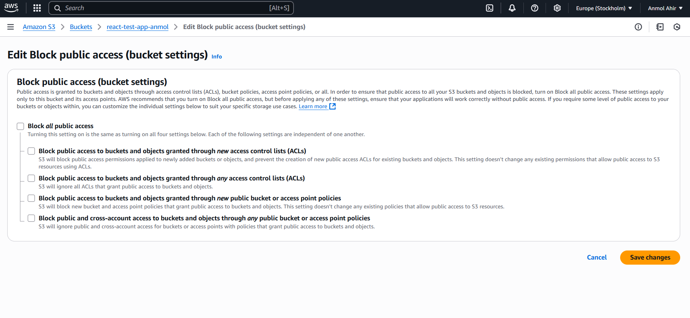


## 5. 👥 Set Object Ownership to Public
- Still under **Permissions** tab
- Scroll to **Object Ownership** and click **Edit**
- Choose:
  - ACLs enabled
  - Bucket owner preferred
- Click **Save changes**

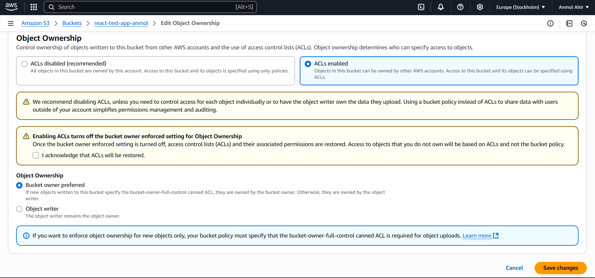


## 6. 🛡 Attach Public Read Policy Using Policy Generator
- Use [AWS Policy Generator](https://awspolicygen.s3.amazonaws.com/policygen.html)
- Fill in:
  - Effect: `Allow`
  - Principal: `*`
  - Action: `s3:GetObject` (or check All actions)
  - ARN: *paste-your-S3-Bucket-ARN*
 
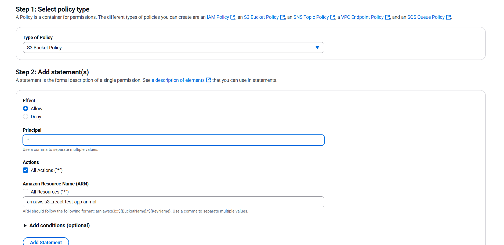
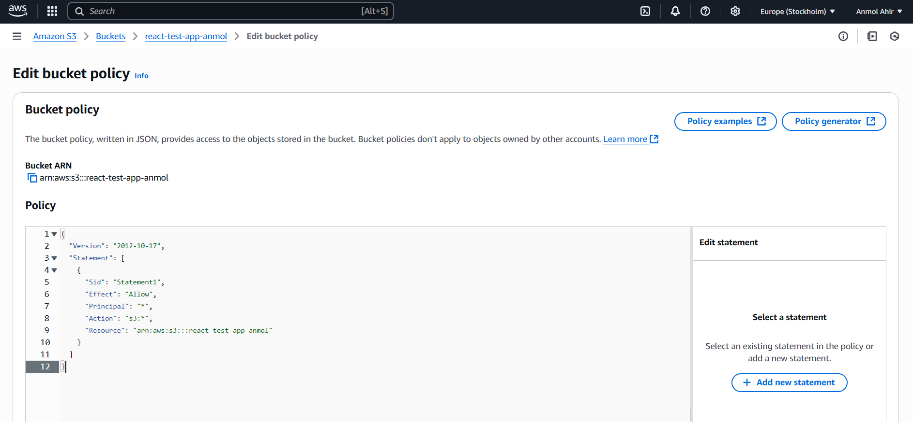


## 7. 🔐 Create Access Keys for IAM User
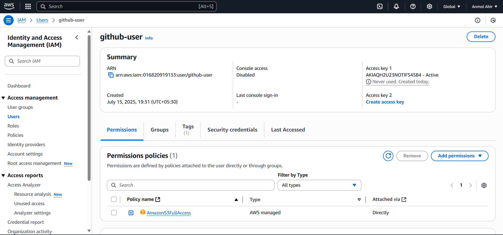

## 8. 🛠 Setup GitHub Actions
- Open your GitHub repository
- Click on the **Actions** tab
- Click **Set up a workflow yourself** or choose **New workflow**

## 9. 📝 Create a Workflow File
- In `.github/workflows/` folder, create a file named `main.yml`
- Paste the following:

```yaml
name: production testing pipeline

on:
  push:
    branches: [main]

jobs:
  deploy:
    name: Build, Test & Deploy Portfolio
    runs-on: ubuntu-latest

    steps:
      - name: Checkout code
        uses: actions/checkout@v3

      - name: Validate Files Exist
        run: |
          test -f Project/Dummy_portfolio/index.html || (echo "index.html missing" && exit 1)
          test -f Project/Dummy_portfolio/style.css || (echo "style.css missing" && exit 1)
          test -f Project/Dummy_portfolio/script.js || (echo "script.js missing" && exit 1)

      - name: Configure AWS Credentials
        uses: aws-actions/configure-aws-credentials@v2
        with:
          aws-access-key-id: ${{ secrets.AWS_ACCESS_KEY_ID }}
          aws-secret-access-key: ${{ secrets.AWS_SECRET_ACCESS_KEY }}
          aws-region: 'ap-south-1'

      - name: Deploy to S3
        run: |
          aws s3 sync Project/Dummy_portfolio/ s3://${{ secrets.AWS_S3_BUCKET_NAME }} --delete
```

## 10. 🔐 Add New Repository Secrets
- Go to **Settings > Secrets and variables > Actions**
- Click **Add new repository secret**
  
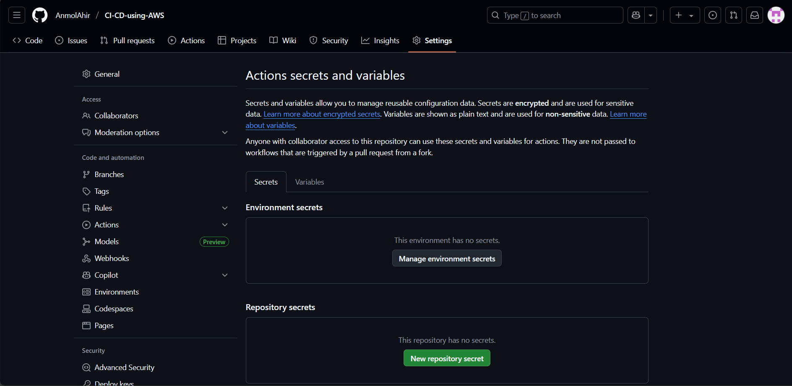

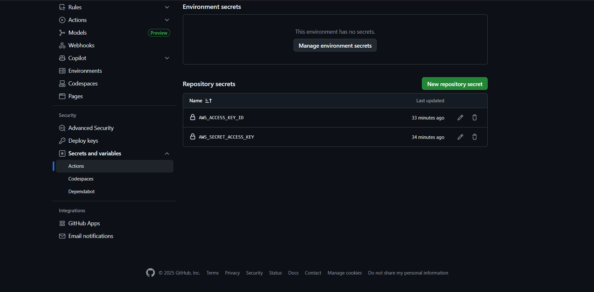
